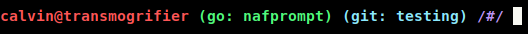

# notafancy-prompt

nafprompt is a "minimal" "prompt" for the bash shell that leverages its builtin functionality. The goal is to try to implement as many features as possible only using libraries included in the start golang distribution.
In short, nafprompt tries to make configuring your prompt easier, while providing some QoL features.
There are many projects that provide a Powerline prompt, and hence this program does not aim to provide that feature.
As of 3/2/2023 I have deemed this project mostly feature complete. Any commits to this repository will mainly focus around the `shellex/` directory which has scripts that extend the functionality of `nafprompt`.

#### Installation

make sure `nafprompt` is in your PATH and append the below code to the end of your `.bashrc`

```
naf_prompt() { 
    export PS1=$(nafprompt); 
}

PROMPT_COMMAND=naf_prompt
```

### Configuration

`nafprompt` can be configured by setting the `PROMPT` variable in your `.bashrc`. If left unconfigured or blank, it will default to the hardcoded prompt.
```
export PROMPT="your-prompt-here"
```

#### Configuration Syntax

In `nafprompt`, configuration and styling is achieved by wrapping appropriate keywords in `{}` curly braces, with colons and semicolons used to pass options to `constructor.go`

##### Simple Keywords

`{user}` displays username\
`{host}` displays host-name\
`{cwd}` displays current working directory\
`{basename}` displays the basename of `{cwd}`\
`{cmdnum}` displays the command number\
`{date}` displays date in Weekday Month Date format\
`{device}` displays basename of shell's terminal device\
`{shellname}` displays the name of the shell\
`{time24}` displays 24-Hour time\
`{time12}` displays 12-Hour time\
`{time12m}` displays 12-Hour time with AM/PM

More information can be found [here](https://tldp.org/HOWTO/Bash-Prompt-HOWTO/bash-prompt-escape-sequences.html)

##### Text Styling

All text is styled in the format `{:text:foreground;background;formatting}` , which applies to all text to the right of the block, until reset by another block. Text is treated as a module for simplicity.
nafprompt supports colors supported by bash:

```
black
red
green
yellow
blue
magenta
cyan
grey
white
```

For all colors except black and white, a lighter shade can be achieved by simply appending an `l` before the name of the color. Any options not recognized will result in the default being applied.

Formatting text is limited by what your terminal emulator implements

```
bold
dim
underline
blink
invert
hide
```

For most configurations, only `bold`, `dim`, `underline`, and `invert` may be necessary. `blink` does not work in the majority of terminal emulators, and `hide` defeats the purpose of a prompt.

##### Modules

"Modules" attempt to display changing information. Currently, only one module exists. The general syntax for a module is:
`{:id:arg1;arg2}`\
The use of a module is indicated by enclosing its name (or ID) in colons. In this fashion text coloring is also treated like a module although it can be considered a standard function.

###### Module: Go Project

`{:go:displaystring}` displays the current go project your working directory is in, if it exists.
This requires the `go` binary to be in your path.
`displaystring` is the string to display when inside a go project. Insert %s to format that part of the string with the name of the go project.

###### Module: Git - Branch and Commit ID

`{:git:displaystring}` displays the current branch you are in in a git repository and the last commit ID.
This requires the `git` binary to be in your path.
`displaystring` can be formatted with `%b` and `%c` to include branch and commit, respectively.

### Screenshots
